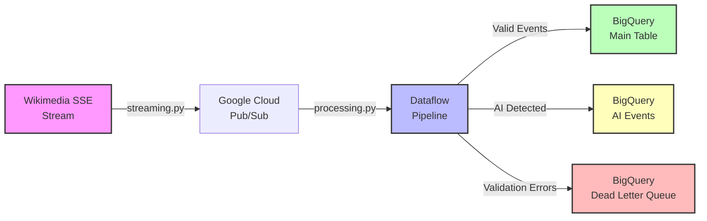

# Wikipedia Edit Stream Pipeline

### Real-time AI-like-writing detection system processing 100+ events/second on Google Cloud

[](https://github.com/aglines/wiki-edits/actions)
[](https://github.com/aglines/wiki-edits/actions)
[](https://www.python.org/downloads/)
[](LICENSE)
[](https://github.com/psf/black)

**A data engineering project demonstrating real-time streaming architecture and scalable pattern detection to (potentially) identify AI-like editing of Wikipedias.**

**Tech Stack:** Apache Beam • Google Cloud Dataflow • BigQuery • Pub/Sub • Python

**Important:** This is a proof-of-concept showcasing data engineering skills. Detection rules are exploratory and unvalidated; see [Project Scope](#project-scope) for details.

---

## Engineering Highlights

| Component | Implementation | Capability |
|-----------|----------------|------------|
| **Streaming Ingestion** | Wikimedia SSE → Pub/Sub | ~100 events/sec, exponential backoff retry |
| **Processing Pipeline** | Apache Beam on Dataflow | 1-10 autoscaling workers, throughput-based |
| **Pattern Detection** | 11 configurable rules (JSON) | Side outputs for flagged events |
| **Data Quality** | Dead Letter Queue + validation | Separate error tracking & debugging |
| **Storage Layer** | BigQuery (3 tables) | Valid/Flagged/DLQ separation |
| **Observability** | Structured logging + schemas | JSON audit trails, time-series analysis |

## Architecture



**Data Flow:** Ingestion → Filtering & Extraction → Pattern Detection → Schema Validation → BigQuery Storage

## By the Numbers

- **~1M total events** processed through the pipeline
- **~12K events flagged** by detection patterns (exploratory sample)
- **11 detection patterns** across 3 categories (v1.0.2)
- **3 BigQuery tables** for data quality separation
- **1-10 workers** autoscaling based on throughput
- **100+ events/sec** processing capacity
- **Sub-second latency** with streaming engine

## Quick Start

```bash
# Install dependencies using uv (recommended)
uv sync

# Run locally with sample data
uv run python main.py local --max-events 20

# Stream real Wikipedia edits to Pub/Sub
uv run python main.py stream --max-events 1000

# Process with Dataflow (requires GCP setup)
uv run python main.py pipeline
```

See [Installation](#installation) for detailed setup instructions.

---

## Project Scope

### What This Project Demonstrates 

**Data Engineering Capabilities:**
- Real-time streaming data processing at scale (Apache Beam/Dataflow)
- Scalable ETL architecture for high-volume event streams
- Data quality engineering (validation, error handling, DLQ patterns)
- Pattern-based content monitoring with configurable rules
- Infrastructure as code (GCP Pub/Sub, Dataflow, BigQuery)
- Observability patterns (structured logging, audit trails)

**Technical Skills:**
- Designing decoupled streaming architectures
- Implementing autoscaling and reliability patterns
- Schema design, validation, and evolution
- Side outputs and multi-table data routing
- Dead letter queue implementation
- Iterative rule development and refinement

### Critical Limitations 

**This is NOT a validated AI classifier or research study:**

- **Detection rules are unvalidated** - No ground truth comparison, unknown precision/recall
- **Sampling bias present** - Data collected intermittently, not continuously or representatively
- **Cost constraints** - Comprehensive data collection on GCP proved financially prohibitive
- **False positive concerns** - Simple pattern matching cannot determine actual AI generation
- **No statistical analysis** - Data unsuitable for conclusions about Wikipedia or AI content rates
- **Problematic rules** - The em-dash rule triggered excessively, revealing detection challenges

**Key Insight:** Pattern detection ≠ AI generation confirmation. The system flags text characteristics, but rules would and data would need to be more developed to make more realistic judgments about authorship.

**Bottom Line:** Focus on the architecture and engineering decisions, not the exploratory data patterns. The value lies in how the system works, not what the sampled data might suggest.


---

## Architecture Discussion

### Pipeline Architecture

**Key Technical Decisions:**
- Three-stage processing: Ingestion (SSE→Pub/Sub) → Processing (Beam transforms) → Storage (BigQuery)
- Side outputs pattern for separating AI-flagged events without blocking main pipeline
- Media file handling optimizations (namespace 6)
- Schema validation at multiple stages with DLQ for failures
- Version-controlled detection rules (JSON externalization)

**Detection Rules (v1.0.2):**
- **Level 1:** Direct artifacts (ChatGPT URLs, `turn0search`, attribution metadata)
- **Level 2:** Format anomalies (markdown syntax, emoji in headings, placeholders)
- **Level 3:** Linguistic patterns (promotional language, collaborative phrases, disclaimers)

### Scope & Limitations

**What the System CAN Detect:**
- Presence of specific patterns and phrases
- Format anomalies (markdown vs. wikitext)
- String matches and regex patterns

**What the System CANNOT Determine:**
- Actual AI generation (vs. human writing similar text)
- User intent or awareness
- Content quality or accuracy
- True prevalence rates

**Ethical Considerations:**
- All data from Wikipedia's public edit stream (read-only)
- No private information collected
- Flagged data should NOT be used to identify "bad actors"
- Results unsuitable for Wikipedia quality claims

### Rule Correlation Analysis

**Key Findings:**
- Most detection rules are independent (near-zero correlation)
- `excessive_em_dashes` shows strong negative correlation with other rules
- Suggests data quality issues with that specific rule
- Demonstrates iterative debugging and rule refinement process

**Analysis Methodology:**
- Correlation matrix of 11,910 flagged events
- Co-occurrence patterns between rules
- Identified problematic rules for future improvement

---

## What I Learned

### Technical Skills Gained

**Infrastructure & Architecture:**
- Designing production-grade streaming pipelines from scratch
- Implementing autoscaling strategies based on throughput metrics
- Building reliable data ingestion with retry logic and exponential backoff
- Schema design for multi-table data routing patterns
- Dead letter queue implementation for data quality

**Apache Beam Expertise:**
- ParDo transforms and side outputs
- Windowing and watermarking strategies
- Integration with Google Cloud Dataflow
- Performance optimization (streaming engine, worker configuration)

**GCP Platform Knowledge:**
- Pub/Sub topic and subscription management
- Dataflow job configuration and monitoring
- BigQuery schema design and table operations
- Cost management and autoscaling trade-offs

### Unexpected Challenges

**Detection Rule Issues:**
The em-dash detection rule triggered far more frequently than expected, even after raising thresholds. This revealed fundamental challenges in pattern-based detection—what seems like an obvious indicator can occur naturally in human writing, especially across different languages and writing styles.

**Sampling Bias:**
Running the pipeline at scale proved financially prohibitive. The times and scales of data collection introduced heavy bias toward certain timezones, countries, and editors. I learned that representative sampling requires careful methodology and resources—something beyond the scope of a side project.

**False Positives:**
Marcus Olang's blog post "[I'm Kenyan. I Don't Write Like ChatGPT](https://marcusolang.substack.com/p/im-kenyan-i-dont-write-like-chatgpt)" highlighted how detection methods can flag human editors based on cultural writing patterns. This reinforced that pattern detection without validation is fundamentally limited.

### Key Insight

**Building a system that works ≠ Building a system that proves something.**

The pipeline architecture succeeded as an engineering demonstration:
- It reliably processes events at scale
- It applies rules consistently
- It handles errors gracefully
- It provides observability

But the analytical goals were fundamentally limited by:
- Lack of ground truth data for validation
- Financial constraints preventing comprehensive sampling
- Inherent challenges in pattern-based detection
- Ethical concerns about false positives

This project taught me to clearly distinguish between **technical implementation success** and **analytical validity**—a critical lesson for any data engineering role.

---

## Features

- **Real-time Processing**: Streams Wikipedia edit events using Apache Beam on Google Cloud Dataflow
- **Pattern Detection**: Monitors edits for 11 detection patterns (exploratory, unvalidated)
- **Scalable Architecture**: Auto-scales from 1-10 workers based on throughput
- **Dead Letter Queue**: Captures validation failures for debugging
- **Structured Logging**: JSON-formatted logs for observability
- **Side Outputs**: Separate tracking for pattern-flagged events
- **Media File Handling**: Optimized processing for namespace 6 (media files)
- **Version-Controlled Rules**: JSON-based detection patterns (no code changes needed)

## Prerequisites

- Python 3.9+
- Google Cloud Platform account with:
  - Pub/Sub API enabled
  - Dataflow API enabled
  - BigQuery API enabled
  - Cloud Storage bucket for temp files
- [uv](https://github.com/astral-sh/uv) package manager (recommended)

## Installation

### 1. Clone the Repository

```bash
git clone https://github.com/aglines/wiki-edits.git
cd wiki-edits
```

### 2. Install Dependencies

Using `uv` (recommended):
```bash
uv sync
```

Or using pip:
```bash
pip install -e .
# For development:
pip install -e ".[dev]"
```

### 3. Configure Environment

Copy the example environment file:
```bash
cp .env.example .env
```

Edit `.env` with your GCP configuration:
```env
GCP_PROJECT_ID=your-project-id
GCP_REGION=your-chosen-region
PUBSUB_TOPIC=projects/project-id/topics/topic-id
PUBSUB_SUBSCRIPTION=projects/project-id/subscriptions/subscription-id
GCS_TEMP_LOCATION=gs://your-bucket/temp
BIGQUERY_OUTPUT_TABLE=project-id.dataset.table
```

See [Configuration](#configuration) for all available options.

### 4. Set Up GCP Resources

```bash
# Create Pub/Sub topic and subscription
uv run python scripts/setup/setup_pubsub.py

# Create BigQuery tables
uv run python scripts/setup/setup_tables.py
```

### 5. Set Up Pre-commit Hooks (Optional)

```bash
pre-commit install
```

## Usage

### Local Testing

Test the pipeline locally with synthetic data:

```bash
uv run python main.py local --max-events 20
```

Output will be written to `output/processed_events-*.jsonl`.

### Stream Mode

Ingest real Wikipedia events to Pub/Sub:

```bash
# Stream 10,000 events
uv run python main.py stream --max-events 10000

# Stream for 2 hours
uv run python main.py stream --time 2
```

### Pipeline Mode

Process events with Dataflow:

```bash
uv run python main.py pipeline
```

Monitor the job in the [Google Cloud Console](https://console.cloud.google.com/dataflow).

## Configuration

### Environment Variables

| Variable | Description | Example |
|----------|-------------|---------|
| `GCP_PROJECT_ID` | Google Cloud project ID | `my-project-123` |
| `GCP_REGION` | Compute region | `us-central1` |
| `PUBSUB_TOPIC` | Full Pub/Sub topic path | `projects/my-project/topics/wiki` |
| `PUBSUB_SUBSCRIPTION` | Full subscription path | `projects/my-project/subscriptions/wiki-sub` |
| `GCS_TEMP_LOCATION` | GCS bucket for Dataflow temp files | `gs://my-bucket/temp` |
| `BIGQUERY_OUTPUT_TABLE` | Main output table (project.dataset.table) | `my-project.wiki.edits` |
| `DATAFLOW_MAX_WORKERS` | Maximum autoscale workers | `10` |
| `DATAFLOW_NUM_WORKERS` | Initial workers | `1` |
| `DATAFLOW_MACHINE_TYPE` | Worker machine type | `n1-standard-2` |
| `DATAFLOW_DISK_SIZE_GB` | Worker disk size | `50` |
| `LOG_LEVEL` | Logging verbosity | `INFO` |

### Detection Patterns

Pattern rules are defined in `src/wiki_pipeline/analysis/patterns/detection_patterns.json` (version 1.0.2). These are exploratory patterns, not validated indicators:

- ChatGPT artifacts and URLs
- Prompt refusal phrases
- Emojis in headings and placeholder templates
- Markdown syntax (not wikitext)
- Collaborative communication patterns
- Promotional language
- Excessive em-dashes

Note: These patterns indicate text characteristics, not definitive AI generation.

## Project Structure

```
wiki-edits/
├── src/
│   └── wiki_pipeline/
│       ├── ai_detection.py              # Pattern detection logic
│       ├── analysis/
│       │   └── patterns/
│       │       ├── detection_patterns.json  # Detection rules (v1.0.2)
│       │       └── pattern_loader.py
│       ├── transforms/                  # Beam transforms
│       ├── schema.py                    # BigQuery schemas
│       ├── utils.py                     # Config, logging, helpers
│       └── version.py                   # Version info
├── pipeline/
│   ├── streaming.py                     # Wikimedia → Pub/Sub
│   ├── processing.py                    # Dataflow pipeline
│   └── local_testing.py                 # Local test runner
├── scripts/
│   ├── setup/
│   │   ├── setup_pubsub.py              # GCP Pub/Sub setup
│   │   └── setup_tables.py              # BigQuery table setup
│   ├── ai_events_stats.py               # Detection statistics
│   ├── update_rules.py                  # Rule management
│   └── scan_existing_data.py            # Data scanning utilities
├── tests/
│   ├── unit/                            # Unit tests
│   └── integration/                     # Integration tests
├── dev/                                 # Development utilities
│   ├── debug_pipeline.py
│   ├── test_ai_detection.py
│   └── test_pipeline.py
├── examples/                            # Usage examples
├── docs/                                # Additional documentation
└── main.py                              # Entry point
```

## Monitoring

### View Results in BigQuery

```sql
-- Total events processed
SELECT COUNT(*) FROM `project.dataset.wiki_edits`;

-- Pattern-flagged events
SELECT * FROM `project.dataset.wiki_edits_ai_events`
ORDER BY detection_timestamp DESC
LIMIT 100;

-- Validation errors
SELECT * FROM `project.dataset.wiki_edits_dead_letter`
ORDER BY _validation_timestamp DESC
LIMIT 100;
```

### Check Detection Stats

```bash
uv run python scripts/ai_events_stats.py
```

## Development

### Running Tests

```bash
# Run all tests
uv run pytest

# Run specific test file
uv run pytest tests/unit/test_extractors.py -v

# Run with coverage
uv run pytest --cov=src --cov-report=html
```

### Code Quality

```bash
# Format code
uv run black src/ tests/
uv run isort src/ tests/

# Lint
uv run flake8 src/ tests/
uv run mypy src/
```

## Troubleshooting

### Pipeline Not Receiving Events

1. Check Wikimedia stream connectivity by running streaming mode
2. Verify Pub/Sub setup in GCP Console
3. Check subscription in GCP Console for backlog

### Dataflow Job Fails

- Verify worker service account has required permissions
- Check temp GCS bucket exists and is writable
- Review Dataflow logs in Cloud Console
- Ensure BigQuery tables exist: `uv run python scripts/setup/setup_tables.py`

### Cost Management

Running at scale can become expensive. To control costs:
- Reduce `DATAFLOW_MAX_WORKERS` and `DATAFLOW_NUM_WORKERS`
- Use smaller machine type (e.g., `n1-standard-1`)
- Run intermittently rather than continuously
- Enable streaming engine for better efficiency (default: enabled)

## Performance

- **Throughput**: Handles 100+ events/sec (scales with worker count)
- **Latency**: Sub-second processing with streaming engine
- **Cost**: Varies by region, worker config, and runtime
- **Scalability**: Auto-scales 1-10 workers based on throughput

## Further Reading

- [Wikipedia: Signs of AI Writing](https://en.wikipedia.org/wiki/Wikipedia:Signs_of_AI_writing) - Original inspiration for this project
- [I'm Kenyan. I Don't Write Like ChatGPT](https://marcusolang.substack.com/p/im-kenyan-i-dont-write-like-chatgpt) - Why pattern detection has high false positive rates

## Contributing

See [CONTRIBUTING.md](CONTRIBUTING.md) for development guidelines.

## License

MIT License - see [LICENSE](LICENSE) for details.

## Acknowledgments

- [Wikimedia](https://www.wikimedia.org/) for the public SSE stream
- Wikipedia community for documenting [Signs of AI Writing](https://en.wikipedia.org/wiki/Wikipedia:Signs_of_AI_writing)
- [Apache Beam](https://beam.apache.org/) for the data processing framework
- [Google Cloud Platform](https://cloud.google.com/) for managed infrastructure
- Marcus Olang for highlighting cultural bias in AI detection methods
